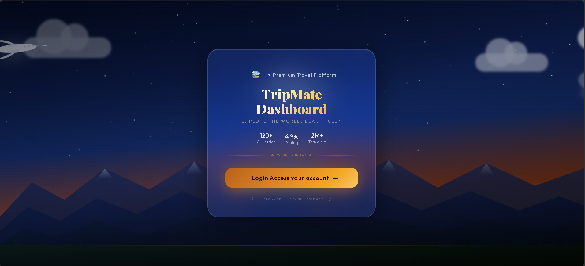
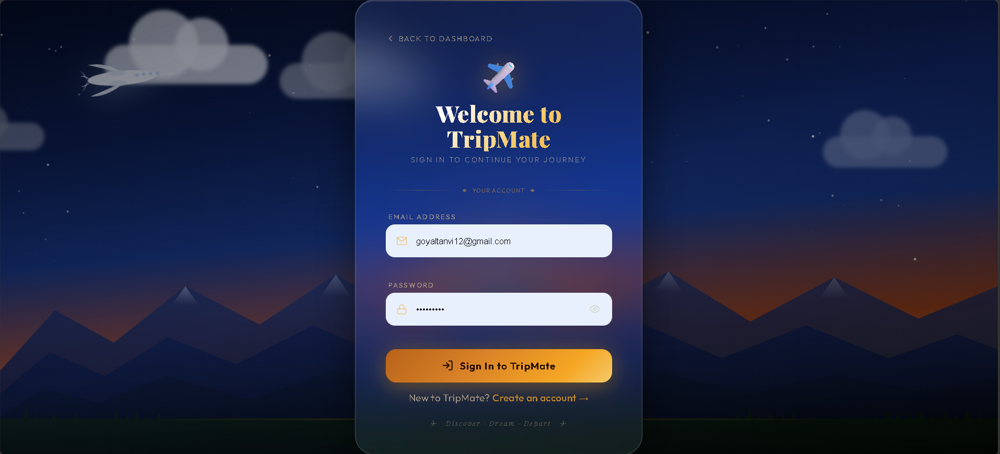
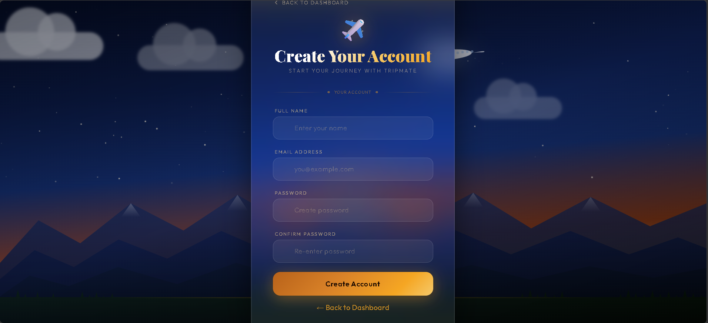
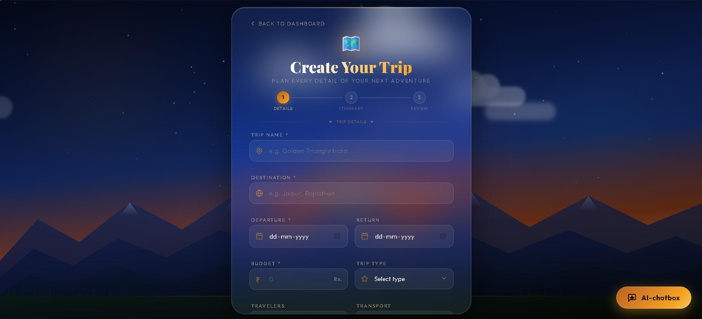
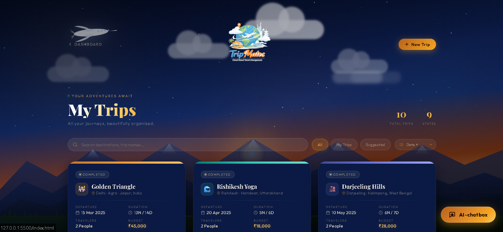
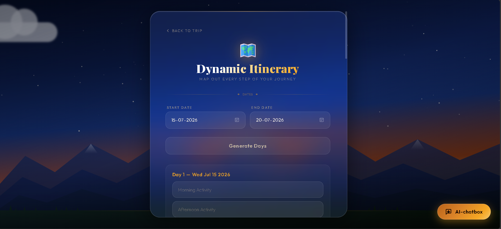
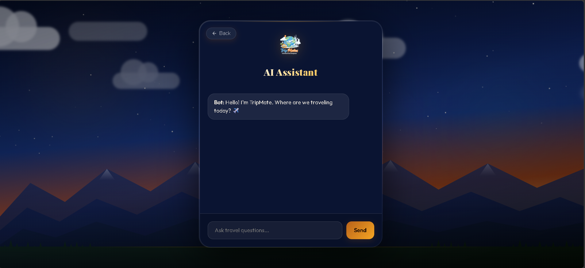
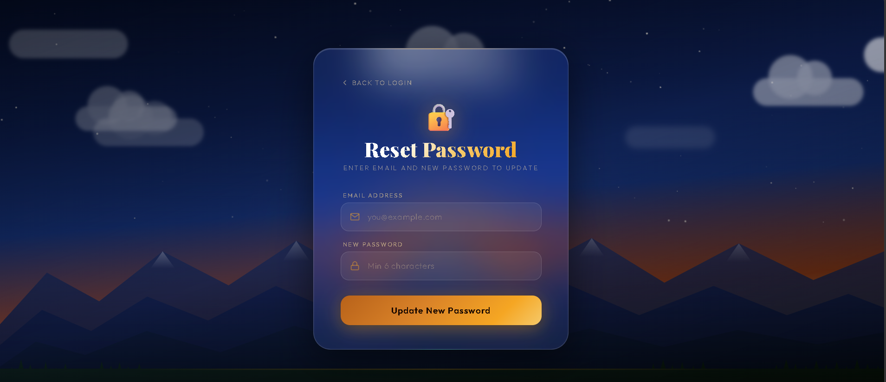

<p align="center">
  
</p>

<h1 align="center">✈️ TripMate</h1>

<p align="center">
  <strong>Cloud-Based Travel Planning Application</strong>
</p>

<p align="center">
A modern travel planning application built using AWS Serverless Architecture to help users organize, manage, and explore trips efficiently.
</p>

<p align="center">


</p>

---

# 📖 About The Project

TripMate is a **cloud-based travel planning application** designed to simplify trip management through a clean, intuitive, and user-friendly interface.

Users can securely create accounts, plan trips, manage itineraries, organize travel details, and interact with an AI-powered travel assistant.

This project was developed to gain practical experience in **Cloud Computing**, **Backend Development**, and **Serverless Architecture** using AWS services.

---

# 👥 Project Information

This application was developed as part of our **College Mini Project**.

### My Role

**Team Leader**

### My Contributions

- Planned and coordinated the overall project development.
- Designed and implemented backend functionalities.
- Developed AWS Lambda functions.
- Integrated Amazon API Gateway with backend APIs.
- Configured Amazon Cognito for authentication.
- Connected the frontend with backend services.
- Worked with NoSQL database integration.
- Participated in testing and debugging.

---

# ✨ Features

- 🔐 Secure User Authentication
- ✈️ Create & Manage Trips
- 📅 Dynamic Travel Itinerary
- 📍 Destination Management
- 🤖 AI Travel Assistant
- 💰 Budget Planning
- 📱 Responsive User Interface
- ☁️ Serverless Cloud Architecture

---

# 🛠 Tech Stack

## Frontend

- HTML5
- CSS3
- JavaScript

## Backend

- Node.js
- AWS Lambda
- REST APIs

## Cloud Services

- Amazon API Gateway
- Amazon Cognito

## Database

- Amazon DynamoDB (NoSQL)

---

# ☁️ AWS Architecture

```text
                HTML • CSS • JavaScript
                        │
                        ▼
              Amazon API Gateway
                        │
                        ▼
                AWS Lambda (Node.js)
                        │
             ┌──────────┴──────────┐
             ▼                     ▼
     Amazon DynamoDB        Amazon Cognito
```

---

# 📸 Project Preview

## Dashboard

<p align="center">

</p>

---

## Authentication

<p align="center">


</p>

---

## Create Trip

<p align="center">

</p>

---

## Trip Details

<p align="center">

</p>

---

## Dynamic Itinerary

<p align="center">

</p>

---

## AI Travel Assistant

<p align="center">

</p>

---

## Forgot Password

<p align="center">

</p>

---

# 🎯 Learning Outcomes

Working on this project helped me gain practical experience with:

- AWS Serverless Architecture
- AWS Lambda
- Amazon API Gateway
- Amazon Cognito
- Amazon DynamoDB
- REST API Development
- Backend Development
- Cloud Computing
- Authentication & Authorization
- Frontend–Backend Integration
- Team Collaboration

---

# 📂 Project Structure

```text
TripMate
│
├── assets
│   └── images
│
├── frontend
│
├── lambda
│   ├── save-trip
│   ├── get-trips
│   ├── delete-trip
│   ├── chatbot
│   ├── post-confirmation-trigger
│   ├── pre-signup-trigger
│   └── archive
│
└── README.md
```

---

# 🚀 Future Improvements

- Google Maps Integration
- Weather Forecast API
- Hotel & Flight Booking APIs
- Real-time Notifications
- AI-Based Trip Recommendations
- Expense Analytics
- Mobile Application

---

# 📌 Project Status

✅ Completed as a College Mini Project.

The project was developed primarily for learning **Cloud Computing**, **Backend Development**, and **AWS Serverless Services**.

---

# ⚠️ Important Note

This repository contains the **source code** and project implementation created during the development of TripMate.

The application was originally built and tested using **AWS Free Tier**, including:

- AWS Lambda
- Amazon API Gateway
- Amazon Cognito
- Amazon DynamoDB

To avoid unnecessary AWS charges after project completion, the cloud resources were intentionally removed.

Therefore:

- ✅ Frontend source code is available.
- ✅ Backend (AWS Lambda) source code is available.
- ✅ Project screenshots are included.
- ❌ A live deployment is currently **not available**.

This repository is maintained as a portfolio project to demonstrate my understanding of **Cloud Computing**, **Backend Development**, and **Serverless Application Development**.

---

# 👩‍💻 Developer

**Tanvi Goyal**

**Role:** Team Leader

B.Tech Computer Science Student

Backend Development • Cloud Computing • AWS • Java • Python

### Connect with Me

- 💼 LinkedIn: https://www.linkedin.com/in/your-linkedin/
- 💻 GitHub: https://github.com/goyaltanvi378-git

---

<p align="center">

⭐ If you found this project interesting, consider giving it a Star!

Made with ❤️ by **Tanvi Goyal**

</p>
